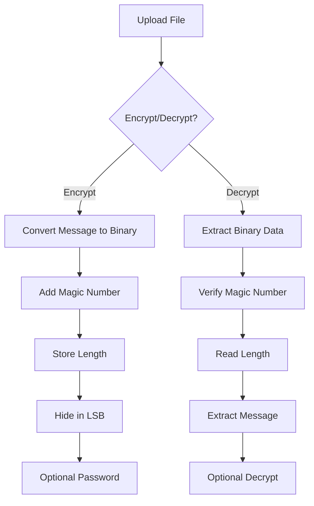

# 🛡️ Invisible Encryption Tool

<div align="center">
  
  [](https://reactjs.org)
  [](https://www.typescriptlang.org)
  [](https://tailwindcss.com)
  [](https://opensource.org/licenses/MIT)

  <p align="center">
    
  </p>

  <h3>🔐 Secure Message Hiding in Plain Sight 🔍</h3>
  <p>Hide encrypted messages within media files using military-grade encryption and advanced steganography</p>

</div>

---

## 🌟 Key Features

<table>
  <tr>
    <td align="center">🔒</td>
    <td><strong>Military-Grade Encryption</strong><br/>AES-256 encryption ensures maximum security</td>
    <td align="center">🎯</td>
    <td><strong>Steganography</strong><br/>Hide messages in images, audio, or video</td>
  </tr>
  <tr>
    <td align="center">💻</td>
    <td><strong>Client-Side Processing</strong><br/>All operations happen in your browser</td>
    <td align="center">🔑</td>
    <td><strong>Password Protection</strong><br/>Optional encryption for extra security</td>
  </tr>
  <tr>
    <td align="center">📱</td>
    <td><strong>Responsive Design</strong><br/>Works on desktop and mobile devices</td>
    <td align="center">🚀</td>
    <td><strong>Fast Processing</strong><br/>Efficient encryption/decryption</td>
  </tr>
</table>

## 🚀 Quick Start

```bash
# Clone the repository
git clone https://github.com/yourusername/invisible-encryption

# Navigate to project directory
cd invisible-encryption

# Install dependencies
npm install

# Start development server
npm run dev
```

## 💻 Tech Stack

<table>
  <tr>
    <td align="center" width="96">
      
      <br>React
    </td>
    <td align="center" width="96">
      
      <br>TypeScript
    </td>
    <td align="center" width="96">
      
      <br>Tailwind
    </td>
    <td align="center" width="96">
      
      <br>Vite
    </td>
  </tr>
</table>

## 📖 Usage Guide

### 🔒 Encryption Process

1. Select **"Encrypt"** mode
2. Upload your media file (PNG, JPG, MP3, MP4)
3. Enter your secret message
4. Add an optional password
5. Click "Hide Message"
6. Download the processed file

### 🔓 Decryption Process

1. Select **"Decrypt"** mode
2. Upload the file with hidden message
3. Enter password (if used)
4. Click "Extract Message"
5. View your hidden message

## 🛡️ Security Features

<table>
  <tr>
    <td>🔐</td>
    <td>AES-256 encryption</td>
    <td>🔒</td>
    <td>LSB steganography</td>
  </tr>
  <tr>
    <td>💻</td>
    <td>Client-side processing</td>
    <td>🔑</td>
    <td>Password protection</td>
  </tr>
  <tr>
    <td>🚫</td>
    <td>No server storage</td>
    <td>🧹</td>
    <td>Memory cleaning</td>
  </tr>
</table>

## ⚡ Performance Optimizations

- **File Handling**: Up to 10MB
- **Processing**: 1MB chunks
- **Operations**: Optimized binary
- **Memory**: Efficient management
- **Speed**: Quick processing cycles

## 🔍 Technical Implementation



## 🤝 Contributing

We welcome contributions! Here's how you can help:

1. 🍴 Fork the repository
2. 🌿 Create your feature branch
   ```bash
   git checkout -b feature/amazing-feature
   ```
3. 💾 Commit your changes
   ```bash
   git commit -m 'Add amazing feature'
   ```
4. 📤 Push to the branch
   ```bash
   git push origin feature/amazing-feature
   ```
5. 🔄 Open a Pull Request

## 📜 License

This project is licensed under the MIT License - see the [LICENSE](LICENSE) file for details.

## 🌟 Support

If you find this tool useful, please:

- ⭐ Star the repository
- 🐛 Report bugs
- 💡 Suggest features
- 🤝 Contribute code

## 📞 Contact & Support

<table>
  <tr>
    <td>
      <a href="https://github.com/VimalChaudhary07">
        
      </a>
    </td>
    <td>
      <a href="mailto:vimalchaudhary011@gmail.com">
        
      </a>
    </td>
  </tr>
</table>

## 🙏 Acknowledgments

- [CryptoJS](https://github.com/brix/crypto-js) - Encryption library
- [Lucide Icons](https://lucide.dev) - Beautiful icons
- [Tailwind CSS](https://tailwindcss.com) - Styling framework

---

<div align="center">
  <sub>Built with ❤️ by <a href="https://github.com/VimalChaudhary07">Vimal Chaudhary</a></sub>
</div>
